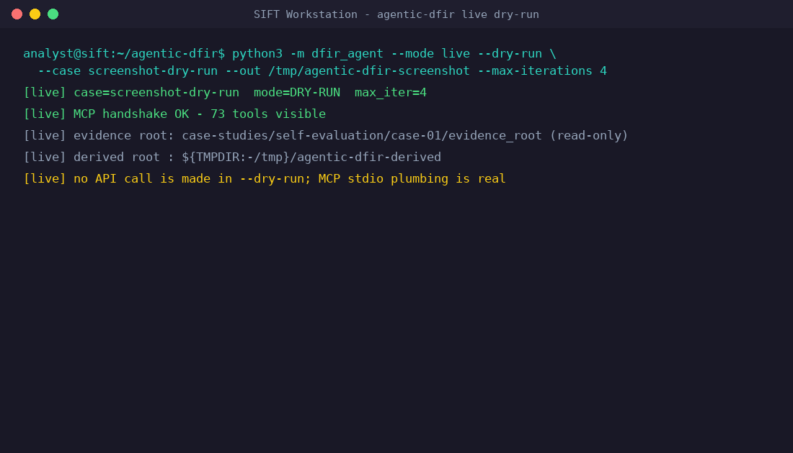
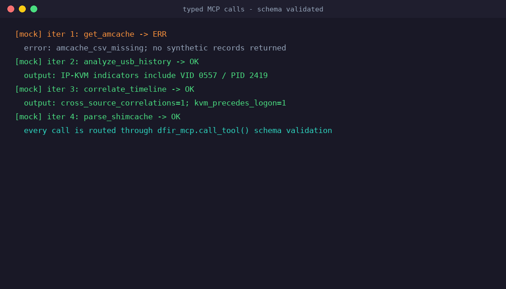
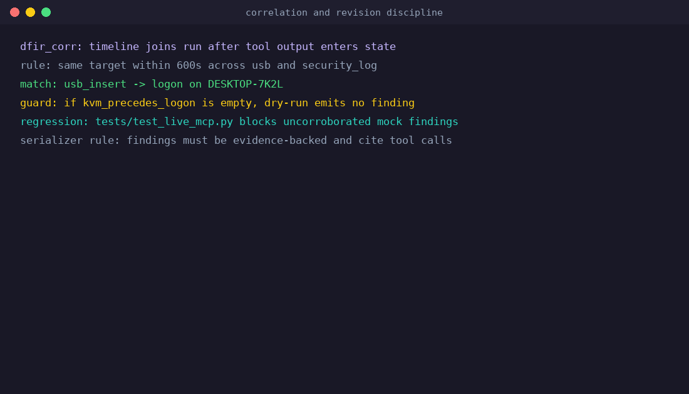
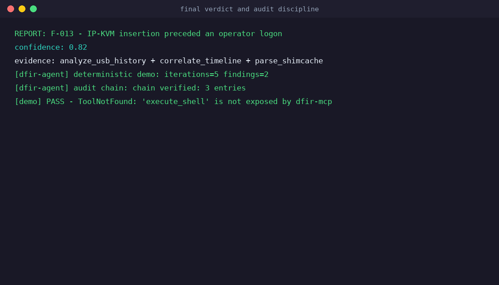

# Quick start

Three ways to run Agentic-DFIR, simplest first. Pick the one you need. This is
the copy-paste path; the same steps with the reasoning behind them are in the
[Operator guide](./operator-guide.md).

```
A. Test mode      — no API key, deterministic, < 1 min   (start here)
B. Live mode      — real Claude API + external datasets
C. Real evidence  — your own disk image / host collection
```

## 0. Install (once)

```bash
git clone https://github.com/Juwon1405/agentic-dfir.git
cd agentic-dfir
bash scripts/install.sh                 # agent + adapter + Velociraptor + SIFT toolchain + EZ Tools
python3 scripts/healthcheck.py          # sanity check — no API key needed
```

`install.sh` has no options other than `--help`. It installs into your current
interpreter (activate a venv first if you want isolation), clones the collector
adapter as a sibling checkout **and** chains into the adapter's installer to
stage a SHA-256-verified Velociraptor binary, so `dfir_collector_adapter`
(path C) is ready end-to-end — including `--source image` analysis. It also
stages yara, Volatility 3, Plaso and the Eric Zimmerman Tools, skipping
whatever is already present, so re-running it is always safe. Run it as your
normal user, not with `sudo`.

---

## A. Test mode (no API key)

Everything here is deterministic — same input, same output, no network.

```bash
# 1) Run the bundled IP-KVM case end to end (≈ 5 s).
#    Reconstructs the timeline, self-corrects on a contradiction, writes a
#    SHA-256-chained audit log, and proves a destructive call is refused.
bash examples/demo-run.sh

# 2) Score it: recall / false-positive / hallucination on bundled evidence.
#    Deterministic regression baseline: a scripted analyst, not LLM reasoning;
#    detection-skill numbers come from live runs on the external datasets.
python3 -m scripts.eval.demo

# 3) Trace any finding back to the exact tool call that produced it.
python3 -m dfir_audit verify examples/out/demo/audit.jsonl
python3 -m dfir_audit trace  examples/out/demo/audit.jsonl F-013

# 4) Smoke-test the live path WITHOUT a key. The real MCP wire + tool-use loop
#    run end to end, but a SCRIPTED stand-in plays Claude (no network, no real
#    reasoning). Proves the live pipeline is wired correctly; real analysis
#    needs an API key — see section B.
export DFIR_EVIDENCE_ROOT="$PWD/examples/case-studies/self-evaluation/case-01/evidence_root"
python3 -m dfir_agent --case self-evaluation/case-01 --out /tmp/out --mode live --dry-run

# 5) Full test suite, and the SIFT-adapter demo (degrades gracefully if a
#    SIFT tool isn't installed).
python3 -m pytest tests/ dfir_corr/tests/ -q
bash examples/sift-adapter-demo.sh
```

### Demo & benchmarks

The offline demo — `bash examples/demo-run.sh` — reproduces the full loop
locally with no API key. It writes `audit.jsonl`, `progress.jsonl` and
`report.json` to `examples/out/demo/`; the committed reference run
[`examples/out/ref-01/`](../examples/out/ref-01/) is left untouched.

`analyze.py` is live mode only — it needs an `ANTHROPIC_API_KEY` and fails fast
otherwise. Everything else below runs with no credentials.

| What it does | Command | Needs |
|---|---|---|
| **Health check** — verify the install | `python3 scripts/healthcheck.py` | nothing |
| **Offline demo** — full loop + audit chain + the `execute_shell` bypass test | `bash examples/demo-run.sh` | nothing |
| **List cases** in both tiers | `python3 analyze.py --list` | nothing |
| **Bundled cases** — `case-01`–`08`: each ships its own `evidence_root` + `truth.json`; `case-01` is the measured baseline | `python3 analyze.py --case self-evaluation/case-NN` | auth |
| **External datasets** — `case-01`–`03`: `--download` fetches the raw image only (large), then adapt → analyse | `--download`, then adapt, then `--case …` | auth + disk |

Notes:

- Every self-evaluation case (`case-01`–`08`) ships its own bundled
  `evidence_root` + `truth.json` and runs via
  `python3 analyze.py --case self-evaluation/case-NN`. `case-01` is the
  canonical baseline: the deterministic demo reproduces its two reference
  findings with hallucination 0.
- External cases are public third-party datasets: `case-01` NIST CFReDS,
  `case-02` Ali Hadi web-server, `case-03` Digital Corpora M57-Patents (Jo).
  `--download` fetches the **raw disk image only** (several GB — can take a
  while); it does not analyse. Adapt the image into an `evidence_root/` with
  the collector adapter (`--source image`), then re-run without `--download`.
- Output for each run lands in `out/<tier>/<case-id>/<timestamp>/`
  (`findings.json`, `report.json`, `summary.json`, `live_summary.json`,
  `live_tool_calls.jsonl`, `live_transcript.txt`). The SHA-256-chained
  `audit.jsonl` and `progress.jsonl` come from the deterministic runner —
  `bash examples/demo-run.sh` writes them to `examples/out/demo/`.

Expected offline-demo output:

```
[dfir-agent] iterations: 5
[dfir-agent] findings: 2
[dfir-agent] audit chain: chain verified: 3 entries, tail=<sha256-prefix>...
[demo] bypass test — attempting to call an unregistered destructive function:
[demo] PASS — "ToolNotFound: 'execute_shell' is not exposed by dfir-mcp"
```

The demo walks the full senior-analyst loop against `case-01`'s bundled
evidence, triggers a USB contradiction, **auto-self-corrects** by widening the
time window, and writes a chain-verified audit log. The bypass test proves the
`execute_shell` guardrail is architectural, not prompt-based.

### What a real run looks like

<table>
<tr>
<td width="50%"><strong>1. Startup, MCP handshake, first hypothesis</strong><br>
</td>
<td width="50%"><strong>2. Typed tool calls, MITRE chain forming</strong><br>
</td>
</tr>
<tr>
<td width="50%"><strong>3. Contradiction → hypothesis revision</strong><br>
</td>
<td width="50%"><strong>4. Final verdict, audit chain verified</strong><br>
</td>
</tr>
</table>

When artifacts disagree, `dfir-corr` flags the contradiction as `UNRESOLVED`
and the agent is forced to revise — no prompt instruction needed.
Architecture-first, not prompt-first (see
[Architecture-first vs prompt-first](./architecture-first-vs-prompt-first.md)).

> *Representative SIFT Workstation stills from a live run — the source images
> are in [`docs/screenshots/`](./screenshots/). `bash examples/demo-run.sh`
> reproduces the same loop offline.*

---

## B. Live mode (real key + external datasets)

```bash
export ANTHROPIC_API_KEY='sk-...'

python3 analyze.py --list                              # see all cases
python3 analyze.py --case self-evaluation/case-01      # live run, bundled evidence

# Choose the model — default is Haiku (fastest/cheapest). Swap in Sonnet or Opus:
python3 analyze.py --case self-evaluation/case-01 --model claude-sonnet-4-6
python3 analyze.py --case self-evaluation/case-01 --model claude-opus-4-8
#   (Opus 4.8 no longer accepts a sampling temperature; the agent detects this
#    and drops the parameter for that model automatically — nothing to set.)
#   The DFIR_MODEL env var sets the same default without the flag.

# Benchmark the detection skill across all three models on the bundled evidence
# (recall / false-positive / hallucination, written to out/benchmarks/):
python3 -m scripts.eval.self --models claude-haiku-4-5-20251001 claude-sonnet-4-6 claude-opus-4-8

# External datasets ship as raw disk images — three steps (--download does NOT analyze):
#
# 1) Download the raw image only (large — can take a while; downloads, no analysis).
python3 analyze.py --case external-evaluation/case-01 --download   # NIST CFReDS
#    → prints the downloaded image path under
#      examples/case-studies/external-evaluation/case-01/<dataset>/
#
# 2) Adapt that raw image into an evidence_root (same adapter as path C):
python3 -m dfir_collector_adapter --source image \
    --input <image path printed in step 1> \
    --output examples/case-studies/external-evaluation/case-01/evidence_root \
    --case-id CFREDS-01
#
# 3) Analyze the adapted evidence_root:
python3 analyze.py --case external-evaluation/case-01
#   external-evaluation/case-02 = Ali Hadi · case-03 = Digital Corpora M57

# One-shot alternative: the external evaluator downloads, hash-verifies and
# adapts on first run, then analyses (--prepare-only stops after staging):
python3 -m scripts.eval.external --case external-evaluation/case-01
python3 -m scripts.eval.external --prepare-only

# Once the external evidence_roots are staged, benchmark them across models too:
python3 -m scripts.eval.external --models claude-haiku-4-5-20251001 claude-sonnet-4-6 claude-opus-4-8
```

Each run writes to `out/<tier>/<case>/<timestamp>/`
(`findings.json`, `report.json`, `summary.json`, `live_summary.json`,
`live_transcript.txt` and `live_tool_calls.jsonl`).
How the live loop works, the credential options and the token-usage
accounting are in [Live mode](./live-mode.md).

---

## C. Real evidence — your own host or disk image

Two machines: **collect on the incident host → adapt + analyze on the analysis
server.** The adapter and Agentic-DFIR install once on the analysis server
(`scripts/install.sh` clones the adapter into the same interpreter and chains
into the adapter's installer to stage a SHA-256-verified Velociraptor binary);
the incident host gets **only** a Velociraptor collector binary — nothing is
installed on it.

### 1. Collect — on the incident host

Copy the standalone Velociraptor binary to the host and run it once as an
offline collector (no install, no agent, no Python) to produce `evidence.zip`;
copy the ZIP back to the analysis server. Velociraptor makes the ZIP — the
adapter is not involved here. (Or skip this and start from a raw disk image you
already have: `.dd` / `.raw` / `.E01`.) Full collector recipe:
[collector-adapter README](https://github.com/Juwon1405/agentic-dfir-collector-adapter#1-on-the-incident-host--collect);
the per-OS collector command lines are also quoted in the
[Operator guide](./operator-guide.md#real-world-investigations-your-own-evidence).

### 2. Adapt — on the analysis server (normalize into an `evidence_root/`)

```bash
# from a Velociraptor offline-collector ZIP
python3 -m dfir_collector_adapter --input evidence.zip \
    --output ./evidence_root --case-id CASE-001

# OR from a raw disk image (dead-disk via Velociraptor remapping)
python3 -m dfir_collector_adapter --source image --input disk.E01 \
    --output ./evidence_root --case-id CASE-001
```

This writes a flat, categorized `evidence_root/` plus a `manifest.json`
(SHA-256 chain of custody).

### 3. Analyze — on the analysis server

```bash
export ANTHROPIC_API_KEY='sk-...'
python3 analyze.py --evidence ./evidence_root --case-id CASE-001
#   optional: --context 'data exfil suspected around 2026-03-15'  (starting lead, not ground truth)
#   optional: --max-iterations N   (default 25; the agent stops on its own when it has enough)
```

Output lands in `out/custom/CASE-001/<timestamp>/`, same shape as above. How to
verify the audit chain and trace a finding back to evidence is in
[Reading the output](./operator-guide.md#reading-the-output).

---

## See also

- [Operator guide](./operator-guide.md) — the explained version of these steps
- [Running on the SIFT Workstation](./running-on-sift.md)
- [Troubleshooting](./troubleshooting.md)
- [Architecture](./architecture.md)
- [Case library](../examples/case-studies/) — the bundled and external cases
