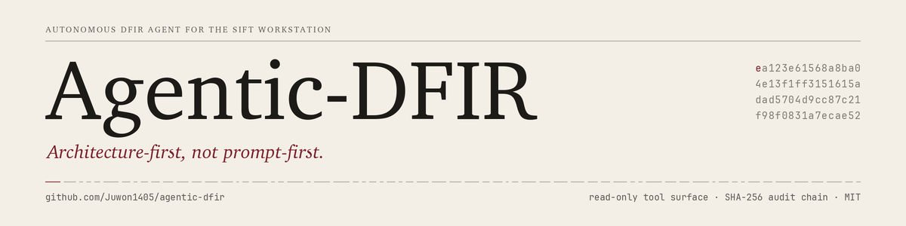

  

# Documentation index

This directory is the complete documentation set for Agentic-DFIR: one page per topic, organised into five groups — where to start, the concepts behind the design, the architecture and the tool surface, evaluation and case studies, and the project itself — with the per-package reference kept in each package's own README and the benchmark ledger kept under `benchmarks/`.

## Start here

- [Quick start](./QUICKSTART.md) — the copy-paste path: install, run the deterministic demo without an API key, run the bundled benchmarks, then point the agent at your own disk image or host collection.
- [Overview](./overview.md) — what Agentic-DFIR is and is not, the pitch and the bet behind it, the three problems a prompt-first agent cannot solve, the single design principle, the target case class, the architectural guarantees, and the development approach.
- [Operator guide](./operator-guide.md) — the explained version of the same commands for a DFIR engineer running a real case folder: install and requirements, evidence-mounting discipline, deterministic and live modes, reading and verifying the output, running the tests.
- [Running on SIFT](./running-on-sift.md) — SIFT Workstation setup from a fresh image to a verified run, with notes on what SIFT already provides and where its defaults get in the way.
- [Troubleshooting](./troubleshooting.md) — known issues and their resolutions, one section per symptom, grouped by installation, runtime and evidence handling, each marked as a fault or a designed refusal.
- [FAQ](./faq.md) — short answers to the questions that come up first, each linking to the page that covers the topic in depth.
- [Glossary](./glossary.md) — DFIR, agent and MCP terms with the meaning they carry in this project, giving the exact file, test or command name where a term names one.

## Concepts

- [About the name](./about-the-name.md) — what "Agentic-DFIR" says, why the prefix is there, and the four-phase plan the name is designed to outlast.
- [The Memex bet](./memex-bet.md) — the long form of the bet underneath the project: the senior analyst's reasoning is the durable, compounding artifact, traced from Vannevar Bush's Memex through Karpathy's LLM Wiki pattern, with a reading list.
- [Architecture-first vs prompt-first](./architecture-first-vs-prompt-first.md) — the central design claim, what the prompt-first alternative looks like and why it fails, the bypass test that makes the claim executable, and what architecture cannot do.
- [Threat model](./threat-model.md) — the one threat class the read-only boundary makes structurally impossible, the threats it does not address, what "read-only" means layer by layer, and what the audit chain does and does not prove.
- [Comparison with adjacent tools](./comparison.md) — how Agentic-DFIR relates to Velociraptor, KAPE, Plaso, Timesketch, SIEM/EDR and AI agent frameworks, and the concern-by-concern table against a prompt-first baseline agent.

## Architecture and tool surface

- [Architecture](./architecture.md) — the five packages and the single read-only boundary between them, the repository layout, why DuckDB and why a SHA-256-chained audit log, the three layers that protect evidence, and what was deliberately not built.
- [MCP function catalog](./mcp-function-catalog.md) — every one of the 48 native pure-Python functions on the 73-tool surface: the artifact it reads, what it is for, the MITRE ATT&CK tactics and techniques it speaks to, and the published reference its logic follows.
- [SIFT Workstation adapter layer](./sift-adapter-layer.md) — the 25 typed read-only adapters over Volatility 3, the Eric Zimmerman tools, YARA and Plaso: what is exposed, how each resolves its binary, the contract every adapter must satisfy, and how to verify the layer.
- [Platform support](./platform-support.md) — where the agent runs and what it can analyze, the native functions by platform, the adapters by tool family, the references the surface is built from, and the MITRE ATT&CK tactics it covers.
- [Live mode](./live-mode.md) — Claude driving `dfir-mcp` over JSON-RPC stdio: why both modes exist, what the live loop does, authentication, what it writes, token-usage accounting and prompt-cache verification, and the wire-level tests that prove the boundary holds.
- [`dfir_mcp`](../dfir_mcp/README.md) — the custom MCP server: how the surface is registered and guarded, how to run it, and which tests hold the boundary in place.
- [`dfir_agent`](../dfir_agent/README.md) — the wrapper loop: the CLI, the iteration controller and hard cap, deterministic and live modes, credential resolution, and how the playbook reaches the model.
- [`dfir_audit`](../dfir_audit/README.md) — the append-only SHA-256-chained JSONL log: entry format, integrity properties, the `verify` / `lookup` / `trace` / `summary` CLI, and what chain integrity does not prove.
- [`dfir_corr`](../dfir_corr/README.md) — the cross-artifact correlation engine on DuckDB: the three public functions, the rule pack, how they reach the MCP wire, and how to run its tests.
- [`dfir_playbook`](../dfir_playbook/README.md) — the three bundled playbooks, what v3 adds over v2, the methodology behind each phase, the schema of `senior-analyst-v3.yaml`, what the runtime consumes from it, and how to fork one.
- [`dfir_sigma`](../dfir_sigma/README.md) — the consolidated, versioned Sigma detection pack that `match_sigma_rules` evaluates, and how it differs from the playbook.

## Evaluation and case studies

- [Dataset](./dataset.md) — the two evidence tiers: bundled self-evaluation cases with authored ground truth, and public third-party material downloaded on demand, with sources and license notes.
- [Case study: IP-KVM remote-hands insider](./case-ip-kvm.md) — the bundled executable case that the demo runs: what the agent does at each iteration, what `audit.jsonl` records, and how a finding traces to the tool call, source artifact and output hash on the committed reference run.
- [Case study: Pass-the-Hash with timestomp pre-existence](./case-pth-timestomp.md) — the conceptual walkthrough of a run against a two-host breach: which functions are called, how `dfir-corr` surfaces a contradiction, and how the agent revises its hypothesis because of it.
- [Writing case studies](./writing-case-studies.md) — adding a bundled case: what a good case looks like, where its files go, how `truth.json` is structured and validated, how to run and score against it, and what a pull request needs to carry.
- [Evidence and case studies](../examples/README.md) — the `examples/` tree: the canonical bundled evidence, the case-study tiers, and the reference run output.
- [Evaluation suite](../scripts/eval/README.md) — `scripts/eval/`: self and external measurement, the dataset downloader, scoring, ground-truth validation, and how scoring works.

## Project

- [Roadmap](./roadmap.md) — Phase 1 in operator's-eye detail (shipped, open, deferred by design), the Phase 1 rollout table, companion projects, Phases 2–4 as directions rather than promises, and what is explicitly not on the roadmap.
- [The self-learning loop](./self-learning-loop.md) — the Phase 2 design for improving analysis quality from the agent's own execution traces, without fine-tuning and without loosening the read-only guarantee.
- [External skill references](./external-skill-references.md) — the Anthropic-Cybersecurity-Skills candidates tracked for future absorption, marking what is already covered and what could be ported.
- [Tests](../tests/README.md) — the `pytest` suite: what each test file covers, the layout of fixtures and pending tests, and how CI runs it.
- [Scripts](../scripts/README.md) — repository tooling: installation, the health check, the evaluation suite entry points, and asset regeneration.
- [Changelog](../CHANGELOG.md) — release history, newest first.

## Subdirectories

- **`screenshots/`** — the four sample-run stills (`dfir-run-01-init.png` through `dfir-run-04-final.png`) used by the Quick start, the Pass-the-Hash case study and the Roadmap.

The architecture diagram lives at the top level of this directory: `dfir-architecture.drawio` is the editable source and `dfir-architecture.png` is the rendered image used by the project README and the Architecture page. Edit the `.drawio` file and re-export the PNG; do not edit the PNG directly. The banner at the top of this page (`banner.png`) is drawn by `scripts/regenerate_hero.py`, described on the Scripts page.

## See also

- [Project README](../README.md) — the landing page: quick start, architecture summary, companion projects
- [`CONTRIBUTING.md`](../CONTRIBUTING.md) — how to contribute, and what is not accepted
- [`SECURITY.md`](../SECURITY.md) — reporting a guardrail bypass
- [`LICENSE`](../LICENSE) — MIT
