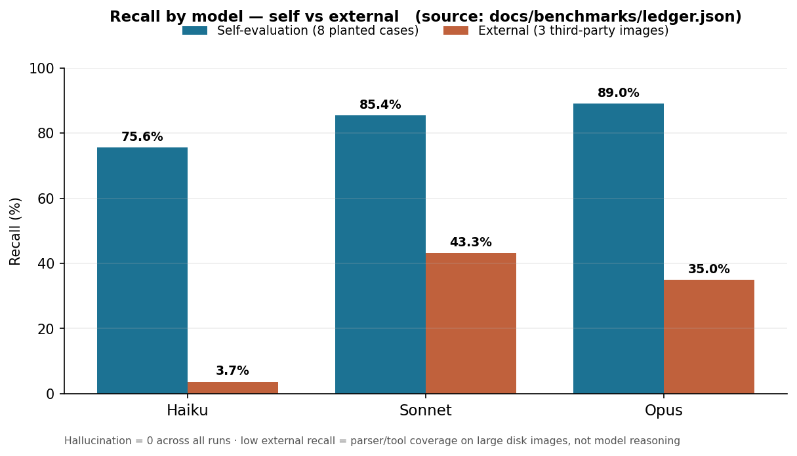

# Benchmarks — Recall by Model (self vs external)

Honest, reproducible measurement of Agentic-DART's detection recall. Every number here is rendered from the per-case ledger ([`ledger.json`](ledger.json)) — not transcribed by hand — so it cannot drift out of sync with the harness.

## What we measured

Each case was run **live** against all three Claude models, multiple times, and scored as `recall = detected / scorable ground-truth findings`.

- **Self-evaluation** — 8 planted cases with known ground truth (`truth.json`).
- **External** — 3 third-party public forensic images (NIST CFReDS, Ali Hadi, Digital Corpora M57).
- Per-case detail: [`MODEL-COMPARISON.md`](MODEL-COMPARISON.md) · run history: [`HISTORY.md`](HISTORY.md) · totals: [`SUMMARY.md`](SUMMARY.md).

| Model | Mean recall | Self (8) | External (3) | Hallucination |
|---|:--:|:--:|:--:|:--:|
| `claude-opus-4-8` | **74%** | 89% | 35% | 0 |
| `claude-sonnet-4-6` | **74%** | 85% | 43% | 0 |
| `claude-haiku-4-5` | 56% | 76% | 4% | 0 |

## What it means

- **Opus and Sonnet tie overall (74%)** — both are viable authoritative backends; Haiku (56%) is the cheap triage tier.
- **Opus leads on self-evaluation (89%)**; **Sonnet generalises best to unseen public images (external 43% vs 35%)**. So: prefer Opus on self-class evidence, Sonnet on out-of-distribution material.
- **Low external recall is a tool/parser-coverage limit on large real disk images — not a reasoning failure.** Many external answers require parsers still on the roadmap. We report the low number openly rather than hiding it.
- **Hallucination is 0 across every run, by construction:** any finding lacking an `audit_id` reference to a chained tool call is blocked at write time. A miss is *missed coverage*; a fabricated finding cannot reach the report at all.
- **Run-to-run variance is real** (LLMs are probabilistic). A single lucky run is not a verdict — which is exactly what the roadmap below targets.

## Limitations (stated plainly)

- The external set is only 3 datasets — a small sample that weights the mean toward self-evaluation.
- Self-evaluation runs on self-authored cases; high self recall is necessary but not sufficient evidence of generalisation.
- Ground truth is the *tool-reachable* subset of each case; findings needing un-built parsers are out of scope by construction.

## Roadmap — how we plan to raise recall **and** consistency

The goal is a system whose best result is reproducible regardless of operator skill — DFIR quality should come from the architecture, not from luck or prompt-craft.

1. **Loop engineering (self-learning / Evaluation-Driven Development).** A background `Run → Reflect → Extract → Loop`: the agent reflects on what worked, distils reusable procedure into the playbook / Sigma rules, and re-runs. Every change is versioned and gated by **held-out** recall — promoted only if it improves unseen cases without regression, auto-rolled-back otherwise. Consistency will be tracked with a `pass^k` metric (success rate over *k* repeated runs), not just mean recall.
2. **Prompt-as-architecture (system + playbook strengthening).** The investigative "mega-prompt" — role, objective, context, steps, examples, output format — is encoded as deterministic, versioned, code-owned components the system assembles per case, instead of freeform user prompts. Evidence-derived context and retrieval-augmented exemplars raise the floor for every operator; strict output-schema + provenance grounding keep hallucination at zero.

> Guardrail: improvements are validated on **held-out** cases to avoid overfitting to our own eval set — the low-but-honest external number is the metric we intend to move, not the self-evaluation number we already do well on.
